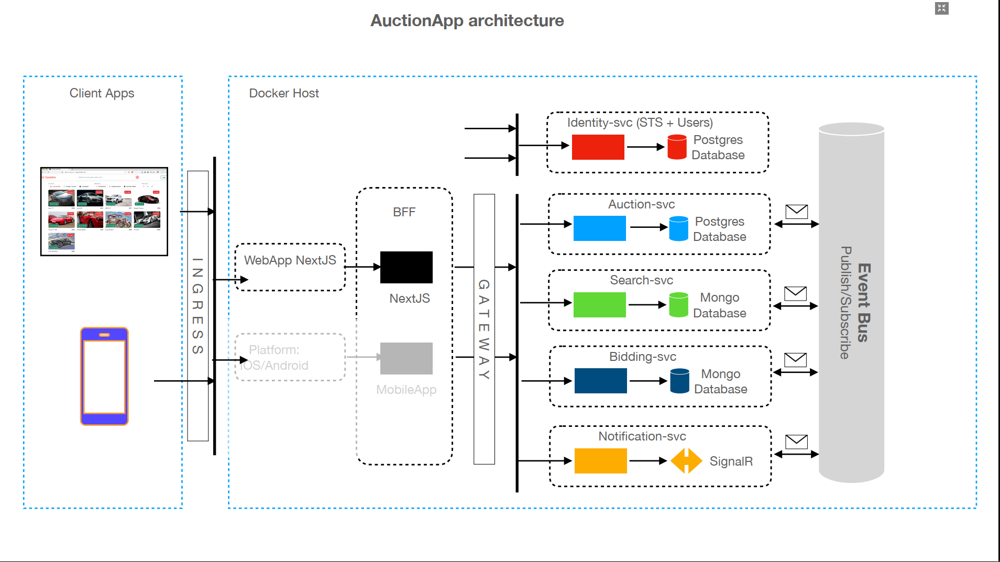

# Introduction:

This is a personal project whose main purpose is to learn an overview of building a web app using microservices.

The languages used are C#, Javascript. Technologies used: .Net Core, EF Core, SignalR, Docker, RabbitMQ, Kubernetes, NextJS...

## System diagram:

## Run BackEnd Microservice

1. Ensure you have Docker Desktop installed on your machine.  If not download and install from Docker and review their installation instructions for your Operating system [here](https://docs.docker.com/desktop/).
2. Build the services locally on your computer by running (NOTE: this may take several minutes to complete):

```
docker compose build
```

3. Once this completes you can use the following to run the services:

```
docker compose up -d
```


## Run FrontEnd

First, run the development server:

```bash
npm run dev
# or
yarn dev
# or
pnpm dev
```

Open [http://localhost:3000](http://localhost:3000) with your browser to see the result.
